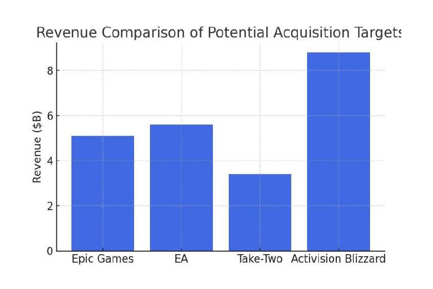
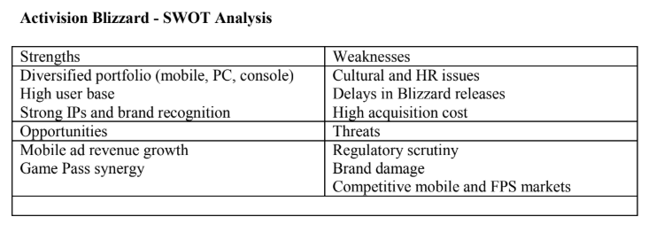

# microsoft-activision-merger-analysis
Strategic financial modeling and analysis for Microsoft's $68.7B acquisition of Activision Blizzard. (Excel, Sensitivity Analysis, Strategic Fit)

# M&A Strategy: Microsoft's $68.7B Acquisition of Activision Blizzard

> **Timeline:** Spring 2025
> **Role:** Strategic Financial Analyst
> **Deliverable:** Investment Recommendation Report
> **Deal Value:** $68.7 Billion (All-Cash Transaction)

---

## The Business Case
**"Is a $68.7 billion price tag—a 45% premium—justified for a company facing cultural and regulatory headwinds?"**

In 2022, Microsoft announced its intent to acquire Activision Blizzard at **$95.00 per share**. The market was skeptical due to Activision's internal controversies and the sheer size of the deal. Our objective was to conduct a **Strategic & Financial Due Diligence** to determine if this acquisition would create long-term shareholder value or destroy it.

---

## Strategic Analysis (Why Activision?)
We evaluated three potential targets: **Epic Games**, **Electronic Arts (EA)**, and **Activision Blizzard**. Our comparative analysis identified Activision as the superior strategic fit despite the higher cost.

* **Mobile Entry (The "King" Factor):** Microsoft lacked a mobile footprint. Acquiring King (Candy Crush) instantly captured ~30% of the mobile market revenue, a synergy EA and Take-Two could not offer.
* **Game Pass Economics:** The addition of *Call of Duty* and *World of Warcraft* was projected to increase Game Pass subscribers by **3-5 million**, creating recurring high-margin revenue.
* **Metaverse Infrastructure:** Unlike EA (sports-focused), Activision provided the backend infrastructure needed for Microsoft's cloud gaming ambitions.

### Comparative Valuation
*We analyzed revenue multiples and strategic fit across the gaming landscape:*

*(Figure 1: Revenue benchmarking showing Activision's dominance over competitors like EA and Take-Two)*

---

## Valuation & Deal Structure
* **Offer Price:** **$95.00 per share** (vs. pre-announcement trading price of ~$65.00).
* **Premium:** **~45% Control Premium**.
* **Financing:** 100% Cash Deal, funded via Microsoft's **$137B cash reserves**.
* **Key Multiples:** The deal valued Activision at approx. **18x EBITDA**, significantly higher than the industry median, reflecting the scarcity value of its IP.

**Investment Verdict:** **BUY / APPROVE**
Despite the high premium, our model projected that the **49% year-over-year revenue jump** in Microsoft's Gaming Division (post-close) would offset the initial capital outlay within 5-7 years.

---

## Risk Assessment (SWOT)
The valuation included a significant discount rate adjustment for **Regulatory Risk** (FTC/CMA blocks) and **Operational Risk** (Cultural turnaround).

*(Figure 2: Strategic risk assessment highlighting the operational challenges vs. the "Game Pass" opportunity)*

---

## Post-Deal Validation
*Evidence that our analysis aligned with actual market outcomes (FY 2024 Q2 Data):*
* **Xbox Content Revenue:** Increased by **61%** post-integration.
* **Gaming Division Revenue:** Jumped **49% YoY**.
* **Synergy Realization:** Successfully integrated King Digital to launch Microsoft's mobile ad revenue stream.

---

### [Full Report (PDF)](docs/MxA Acquisition Analysis Report.pdf)
